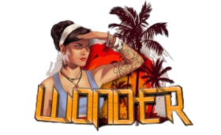

<h1 align="center">
     
    </a>
     
    Wonder Launcher
     
</h1>

<h4 align="center">A simple FiveM custom launcher for GTA V RP.</h4>

    <a href="#key-features">Key Features</a> •
    <a href="#how-to-use">How To Use</a> •
    <a href="#download">Download</a> •
    <a href="#credits">Credits</a> •
    <a href="#license">License</a>

 

## Key Features

* Start the game and connect to FiveM server
* Clear FiveM cache

## How To Use

To use this launcher, you need to have FiveM and GTA V installed on your computer. Once you've downloaded and installed the launcher, simply open it and click on the "Avvia Wonder RP" button to start the game and connect to the FiveM server. If you want to clear the FiveM cache, click on the "Pulisci le Cache" button.

## Download

You can download the latest version of the launcher from the releases page of this repository.

## Credits

This project was made possible thanks to:

* <a href="https://github.com/DiabolikoMods">Diaboliko</a>
* <a href="https://github.com/ColdbloodDK">ColdBloodDK</a>
* <a href="https://discord.gg/gNdSzm2aEv">The entire Wonder RP Staff</a>

## Support

If you like this project and find it useful, consider supporting its development by buying me a coffee:

## License

This project is licensed under the terms of the MIT license.
